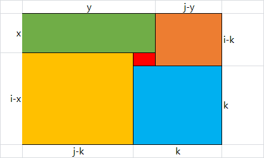

# 动态规划

动态规划是经典的以空间换时间的算法。

将之前的计算结果存储起来，来避免重复计算。这些存储起来的结算结果一般用**一维数组**或者**二维数组**来存储。

## 经典例题

-   计数问题
    -   [LeetCode62 不同路径](#leetcode62-不同路径)
-   最值问题
    -   [LeetCode64 最小路径和](#leetcode64-最小路径和)
    -   [LeetCode53 最大子序列和](#leetcode53-最大子序列和)
    -   [LeetCode322 零钱兑换](#leetcode322-零钱兑换)
    -   [LeetCode72 编辑距离](#leetcode72-编辑距离)
    -   [LeetCode410 分割数组的最大值](#leetcode410-分割数组的最大值)
    -   [LeetCode1240 铺瓷砖](#leetcode1240-铺瓷砖)
-   存在性问题
    -   [LeetCode403 青蛙过河](#leetcode403-青蛙过河)

## 解题套路

1. 定义数组下标与数组元素之间的含义，即定义**最优子结构**；
2. 找出数组元素之间的关系，即确定**转移方程**；
3. 找出初始值，即确定**边界条件**。
4. 自底向上进行计算求解。

## 计数问题

### [LeetCode62 不同路径](https://leetcode-cn.com/problems/unique-paths/)

#### 题目描述

一个机器人位于一个`m x n`网格的左上角 （起始点在下图中标记为 “Start” ）。

机器人每次只能向下或者向右移动一步。机器人试图达到网格的右下角（在下图中标记为 “Finish” ）。

问总共有多少条不同的路径？

**示例 1：**


```
输入：m = 3, n = 7
输出：28
```

**示例 2：**

```
输入：m = 3, n = 2
输出：3
解释：
从左上角开始，总共有 3 条路径可以到达右下角。
1. 向右 -> 向下 -> 向下
2. 向下 -> 向下 -> 向右
3. 向下 -> 向右 -> 向下
```

**示例 3：**

```
输入：m = 7, n = 3
输出：28
```

**示例 4：**

```
输入：m = 3, n = 3
输出：6
```

**提示：**

-   `1 <= m, n <= 100`
-   题目数据保证答案小于等于`2 * 109`

#### 解题思路

##### 定义最优子结构

假设`dp[i][j]`为从起始点到坐标点`(i,j)`的不同路径数。

##### 确定转移方程

则机器人要走到坐标点`(i, j)`有两种情况：

-   从坐标点`(i-1, j)`向右走一步
-   从坐标点`(i, j-1)`向下走一步

可以得到转移方程：`dp[i][j] = dp[i-1][j] + dp[i][j-1]`

##### 确定边界条件

由于`i-1`和`j-1`不可能为`0`，结合题目描述机器人每次只能向下或者向右移动一步，因此：

-   当`i-1=0`时，机器人只能向下走，所以`dp[0][0,1,2,...,n]=1`；
-   当`j-1=0`时，机器人只能向右走，所以`dp[0,1,2,...,n][0]=1`。

##### 自底向上求解

```java
class Solution {
    public int uniquePaths(int m, int n) {
        int[][] dp = new int[m][n];
        for (int i = 0; i < m; i++) {
            dp[i][0] = 1;
        }
        for (int i = 0; i < n; i++) {
            dp[0][i] = 1;
        }
        for (int x = 1; x < m; x++) {
            for (int y = 1; y < n; y++) {
                dp[x][y] = dp[x][y - 1] + dp[x - 1][y];
            }
        }
        return dp[m - 1][n - 1];
    }
}
```

## 最值问题

### [LeetCode64 最小路径和](https://leetcode-cn.com/problems/minimum-path-sum/)

#### 题目描述

给定一个包含非负整数的 `*m* x *n*` 网格 `grid` ，请找出一条从左上角到右下角的路径，使得路径上的数字总和为最小。

**说明：**每次只能向下或者向右移动一步。

**示例 1：**


```
输入：grid = [[1,3,1],[1,5,1],[4,2,1]]
输出：7
解释：因为路径 1→3→1→1→1 的总和最小。
```

**示例 2：**

```
输入：grid = [[1,2,3],[4,5,6]]
输出：12
```

**提示：**

-   `m == grid.length`
-   `n == grid[i].length`
-   `1 <= m, n <= 200`
-   `0 <= grid[i][j] <= 100`

#### 解题思路

##### 定义最优子结构

假设`dp[i][j]`是从起始坐标点到坐标点`(i,j)`的最小路径和。

##### 确定转移方程

由于每次只能向下或者向右移动一步，所以走到坐标点`(i,j)`的可能性有 2 种：

-   从坐标点`(i-1,j)`向右移动一步，此时`dp[i][j]=dp[i-1][j]+grid[i][j]`
-   从坐标点`(i, j-1)`向下移动一步，此时`dp[i][j]=dp[i][j-1]+grid[i][j]`

所以转移方程为`dp[i][j]=min(dp[i-1][j], dp[i][j-1])+grid[i][j]`

##### 确定条件边界

由于`i-1`和`j-1`不可能为`0`，结合题目描述每次只能向下或者向右移动一步，所以：

-   当`i-1=0`时，`dp[0][j]=dp[0][j-1]+grid[0][j]`
-   当`j-1=0`时，`dp[i][0]=dp[i-1][0]+grid[0][j]`

##### 代码

```java
class Solution {
    public int minPathSum(int[][] grid) {
        int rows = grid.length;
        int cols = grid[0].length;
        int[][] dp = new int[rows][cols];
        dp[0][0] = grid[0][0];
        for (int row = 1; row < rows; row++) {
            dp[row][0] = dp[row - 1][0] + grid[row][0];
        }
        for (int col = 1; col < cols; col++) {
            dp[0][col] = dp[0][col - 1] + grid[0][col];
        }
        for (int row = 1; row < rows; row++) {
            for (int col = 1; col < cols; col++) {
                dp[row][col] = Math.min(dp[row - 1][col], dp[row][col - 1]) + grid[row][col];
            }
        }
        return dp[rows - 1][cols - 1];
    }
}
```

### [LeetCode53 最大子序列和](https://leetcode-cn.com/problems/maximum-subarray/)

#### 题目描述

给定一个整数数组 `nums` ，找到一个具有最大和的连续子数组（子数组最少包含一个元素），返回其最大和。

**示例 1：**

```
输入：nums = [-2,1,-3,4,-1,2,1,-5,4]
输出：6
解释：连续子数组 [4,-1,2,1] 的和最大，为 6 。
```

**示例 2：**

```
输入：nums = [1]
输出：1
```

**示例 3：**

```
输入：nums = [0]
输出：0
```

**示例 4：**

```
输入：nums = [-1]
输出：-1
```

**示例 5：**

```
输入：nums = [-100000]
输出：-100000
```

**提示：**

-   `1 <= nums.length <= 3 * 104`
-   `-105 <= nums[i] <= 105`

#### 解题思路

##### 定义最优子结构

**处理数组相关的动态规划题目，一般`dp[i]`表示以第`i`个元素结尾的子数组。**

假设`dp[i]`是以第`i`个元素结尾的最大子序列和，题目答案为`max{dp[i]} 0<=i<=n`。

##### 确定转移方程

此时我们需要确定`dp[i]`、`dp[i-1]`和`nums[i]`之间的关系。

由于题目要求的是连续的子序列，如果舍弃第`i`个元素，那么在计算`dp[i+1]`时，子序列可能不连续。所以第`i`个元素是必填的。

-   如果第`i`个元素与以第`i-1`个元素结尾的子序列组成了新的子序列，那么`dp[i]=dp[i-1]+nums[i]`；
-   如果组成不了新的子序列，**为了保证连续性**，那么`dp[i]=nums[i]`

所以转移方程为：`dp[i]=max(dp[i-1]+nums[i], nums[i])`

##### 确定边界条件

`i`表述数组下标，不可能为`0`。所以`dp[0]`必然是边界条件。此时`dp[0]=nums[0]`。

##### 代码

```java
class Solution {
    public int maxSubArray(int[] nums) {
        int[] dp = new int[nums.length];
        dp[0] = nums[0];
        int max = nums[0];
        for (int i = 1; i < nums.length; i++) {
            dp[i] = Math.max(dp[i - 1] + nums[i], nums[i]);
            max = Math.max(max, dp[i]);
        }
        return max;
    }
}
```

分析代码可以发现，实际上只需要缓存`dp[i-1]`即可。再次精简代码，可得：

```java
class Solution {
    public int maxSubArray(int[] nums) {
        int sum = nums[0];
        int max = nums[0];
        for (int i = 1; i < nums.length; i++) {
            sum = Math.max(sum + nums[i], nums[i]);
            max = Math.max(max, sum);
        }
        return max;
    }
}
```

### [LeetCode322 零钱兑换](https://leetcode-cn.com/problems/coin-change/)

#### 题目描述

给定不同面额的硬币 `coins`和一个总金额`amount`。编写一个函数来计算可以凑成总金额所需的最少的硬币个数。如果没有任何一种硬币组合能组成总金额，返回 `-1`。

你可以认为每种硬币的数量是无限的。

**示例 1：**

```
输入：coins = [1, 2, 5], amount = 11
输出：3
解释：11 = 5 + 5 + 1
```

**示例 2：**

```
输入：coins = [2], amount = 3
输出：-1
```

**示例 3：**

```
输入：coins = [1], amount = 0
输出：0
```

**示例 4：**

```
输入：coins = [1], amount = 1
输出：1
```

**示例 5：**

```
输入：coins = [1], amount = 2
输出：2
```

#### 解题思路

##### 定义最优子结构

假设`dp[i]`为凑成总金额`i`所需要的最少硬币个数。

##### 确定转移方程

为方便分析问题，我们先假定`coins=[1, 2, 5]`。`dp[i]`的可能性有：

-   `dp[i] = dp[i-5]+1` `i-5 >= 0`且`dp[i-5]`有解
-   `dp[i] = dp[i-2]+1` `i-2 >= 0`且`dp[i-2]`有解
-   `dp[i] = dp[i-1]+1` `i-1 >= 0`且`dp[i-1]`有解

所以转移方程为

-   如果`i>=5`，那么`dp[i]=min(dp[i-5], dp[i-2], dp[i-1])+1`
-   如果`5>i>=2`，那么`dp[i]=min(dp[i-2], dp[i-1])+1`
-   如果`2>i>=1`，那么`dp[i]=dp[i-1]+1`

##### 确定条件边界

显然`i=0`时，`dp[0]=0`

##### 代码

```java
class Solution {
    public int coinChange(int[] coins, int amount) {
        if (amount == 0) {
            return 0;
        }
        int[] dp = new int[amount + 1];
        for (int i = 1; i <= amount; ++i) {
            dp[i] = Integer.MAX_VALUE;
            for (int coin : coins) {
                // dp[i - coin] != Integer.MAX_VALUE表示dp[i - coin]有解
                if (i - coin >= 0 && dp[i - coin] != Integer.MAX_VALUE) {
                    dp[i] = Math.min(dp[i - coin] + 1, dp[i]);
                }
            }
        }
        return dp[amount] == Integer.MAX_VALUE ? -1 : dp[amount];
    }
}
```

### [LeetCode72 编辑距离](https://leetcode-cn.com/problems/edit-distance/)

#### 题目描述

给你两个单词 `word1` 和 `word2`，请你计算出将 `word1` 转换成 `word2` 所使用的最少操作数 。

你可以对一个单词进行如下三种操作：

- 插入一个字符
- 删除一个字符
- 替换一个字符

**示例1：**

```
输入：word1 = "horse", word2 = "ros"
输出：3
解释：
horse -> rorse (将 'h' 替换为 'r')
rorse -> rose (删除 'r')
rose -> ros (删除 'e')
```

**示例2：**

```
输入：word1 = "intention", word2 = "execution"
输出：5
解释：
intention -> inention (删除 't')
inention -> enention (将 'i' 替换为 'e')
enention -> exention (将 'n' 替换为 'x')
exention -> exection (将 'n' 替换为 'c')
exection -> execution (插入 'u')
```

**提示：**

- `0 <= word1.length, word2.length <= 500`
- `word1` 和 `word2` 由小写英文字母组成

#### 解题思路

**一般字符串相关的题目都可以通过动态规划来解决。**

##### 定义最优子结构

假设`dp[i][j]`为当字符串`word1`长度为`i`，字符串`word2`长度为`j`，将`word1`转化成`word2`所用的最小操作次数。

##### 确定转移方程

+ 当`word1[i]==word2[j]`时，`dp[i][j]=dp[i-1][j-1]`
+ 当`word2[i]!=word2[j]`时，存在3种情况：
  + 替换字符：`dp[i][j]=dp[i-1][j-1]+1`
  + 删除字符：`dp[i][j]=dp[i-1][j]+1`
  + 插入字符：`dp[i][j]=dp[i][j-1]+1`

所以转移方程为：

+ `dp[i][j]=dp[i][j]`  `word1[i]==word2[j]`
+ `dp[i][j]=min(dp[i-1][j], dp[i][j-1], dp[i-1][j-1]) + 1`  `word1[i]!=word2[j]`

##### 确定条件边界

+ `i-1`不可能为`0` ：`dp[0][i]=i`

+ `j-1`不可能为`0`：`dp[i][0]=i`

##### 代码

```java
class Solution {
    public int minDistance(String word1, String word2) {
        int length1 = word1.length();
        int length2 = word2.length();
        int[][] dp = new int[length1 + 1][length2 + 1];
        for (int row = 0; row <= length1; row++) {
            dp[row][0] = row;
        }
        for (int col = 0; col <= length2; col++) {
            dp[0][col] = col;
        }
        for (int row = 1; row <= length1; row++) {
            for (int col = 1; col <= length2; col++) {
                int prevRow = row - 1;
                int prevCol = col - 1;
                if (word1.charAt(prevRow) == word2.charAt(prevCol)) {
                    dp[row][col] = dp[prevRow][prevCol];
                } else {
                    dp[row][col] = Math.min(Math.min(dp[row][prevCol], dp[prevRow][prevCol]), dp[prevRow][col]) + 1;
                }
            }
        }
        return dp[length1][length2];
    }
}
```

### [LeetCode410 分割数组的最大值](https://leetcode-cn.com/problems/split-array-largest-sum/)

#### 解题思路

##### 定义最优子结构

假设:

- `dp[i][j]`表示前`i`个元素分成`j`个非空的连续子数组和最大值最小。
- `sub[i]`表示以第`i`个元素结尾的子数组和。


##### 确定转移方程

`dp[i][j]=min{max{dp[k][j-1], sub(k+1, i)}}` `0 <= k <= i-1`

$dp[i][j]=\min_{0 \le k \le i}\{\max(dp[k][j-1], sub(k+1, i))\}$

$dp[i][j]=\min_{0 \le k \le i}\{\max(dp[k][j-1], sub[i]-sub[k])\}$

##### 确定条件边界

`dp[0][0]=0`

##### 代码

```java
public class Solution {
    public int splitArray(int[] nums, int m) {
        int n = nums.length;
        int[][] dp = new int[n + 1][m + 1];
        for (int i = 0; i < dp.length; i++) {
            Arrays.fill(dp[i], Integer.MAX_VALUE);
        }
        int[] sub = new int[n + 1];
        for (int i = 0; i < n; i++) {
            sub[i + 1] = sub[i] + nums[i];
        }
        dp[0][0] = 0;
        for (int i = 1; i <= n; i++) {
            for (int j = 1; j <= Math.min(i, m); j++) {
                for (int k = 0; k < i; k++) {
                    dp[i][j] = Math.min(dp[i][j], Math.max(dp[k][j - 1], sub[i] - sub[k]));
                }
            }
        }
        return dp[n][m];
    }
}
```

### [LeetCode1240 铺瓷砖](https://leetcode-cn.com/problems/tiling-a-rectangle-with-the-fewest-squares/)

#### 解题思路

##### 定义最优子结构

假设`dp[i][j]`表示铺满`i*j`的客厅最小需要使用到的方形瓷砖数量。

##### 确定转移方程

任意一个矩形都最多可以分割成5个小矩形。假设右下角的矩形为正方形，且其边长为k。



所以，转移方程为`dp[i][j]=min(dp[x][y]+dp[i-k][j-y]+dp[i-x][j-k]+dp[i+k-x][y-j+k]+1)`，其中：

+ `k`的取值范围为`[1, min(i, j)]`
+ `x`的取值范围为`[0, i-k]`
+ `y`的取值范围为`[j-k, j]`

##### 确定条件边界

很明显：

+ `dp[i][0]=0`，其中`0 <= i <= n`
+ `dp[0][j]=0`，其中`0 <= j <= m`

#### 代码

```java
class Solution {
    public int tilingRectangle(int n, int m) {
        int[][] dp = new int[n + 1][m + 1];
        for (int i = 1; i <= n; i++) {
            for (int j = 1; j <= m; j++) {
                if (i == j) {
                    dp[i][j] = 1;
                    continue;
                }
                dp[i][j] = Integer.MAX_VALUE;
                for (int k = 1; k <= Math.min(i, j); k++) {
                    for (int x = 0; x <= i - k; x++) {
                        for (int y = j - k; y <= j; y++) {
                            dp[i][j] = Math.min(dp[i][j], 1 + dp[x][y] + dp[i - k][j - y] + dp[i - x][j - k] + dp[i - k - x][y - j + k]);
                        }
                    }
                }
            }
        }

        return dp[n][m];
    }
}
```

===tip

执行结果：通过

执行用时：4 ms, 在所有 Java 提交中击败了50.70%的用户

内存消耗：35.2 MB, 在所有 Java 提交中击败了60.56%的用户

===

## 存在性问题

### [LeetCode403 青蛙过河](https://leetcode-cn.com/problems/frog-jump/)

#### 题目描述

一只青蛙想要过河。 假定河流被等分为若干个单元格，并且在每一个单元格内都有可能放有一块石子（也有可能没有）。 青蛙可以跳上石子，但是不可以跳入水中。

给你石子的位置列表`stones`（用单元格序号 升序 表示）， 请判定青蛙能否成功过河（即能否在最后一步跳至最后一块石子上）。

开始时， 青蛙默认已站在第一块石子上，并可以假定它第一步只能跳跃一个单位（即只能从单元格`1` 跳至单元格 `2` ）。

如果青蛙上一步跳跃了`k`个单位，那么它接下来的跳跃距离只能选择为`k - 1`、`k`或`k + 1`个单位。 另请注意，青蛙只能向前方（终点的方向）跳跃。

**示例 1：**

```
输入：stones = [0,1,3,5,6,8,12,17]
输出：true
解释：青蛙可以成功过河，按照如下方案跳跃：跳 1 个单位到第 2 块石子, 然后跳 2 个单位到第 3 块石子, 接着 跳 2 个单位到第 4 块石子, 然后跳 3 个单位到第 6 块石子, 跳 4 个单位到第 7 块石子, 最后，跳 5 个单位到第 8 个石子（即最后一块石子）。
```

**示例 2：**

```
输入：stones = [0,1,2,3,4,8,9,11]
输出：false
解释：这是因为第 5 和第 6 个石子之间的间距太大，没有可选的方案供青蛙跳跃过去。
```

**提示：**

-   `2 <= stones.length <= 2000`
-   `0 <= stones[i] <= 231 - 1`
-   `stones[0] == 0`

#### 解题思路

##### 定义最优子结构

假设`dp[i][k]`表示青蛙能否跳跃`k`个单位跳到第`i`个石头上。其中：

-   `i`表示**青蛙现在所在的石头编号**
-   `k`表示**青蛙上一次跳跃的距离**

当我们找到一个`dp[n-1][k]`为真时，就表示青蛙可以跳到终点第`n-1`个石头。

对于**青蛙当前所在石头编号**为`i`的情况，**青蛙上一次所在的石头编号**记为`j`，由此推出`j`的可能性是`[0, i-1]`。此时，**青蛙上一次跳跃的距离**`k`就等于`stones[i]-stones[j]`。

对于**青蛙当前所在石头编号**为`j`的情况，**青蛙上一次所在的石头编号**记为`j'`，**青蛙上一次跳跃的距离**记为`k'`。

`k`与`k'`的关系有三种情况：

-   `k=k'-1`
-   `k=k'`
-   `k=k'+1`

反之亦然：

-   `k'=k+1`
-   `k'=k`
-   `k'=k-1`

##### 确定转移方程

所以转移方程为：`dp[i][k] = dp[j][k-1] || dp[j][k] || dp[j][k+1]`，其中`j` 表示**青蛙上一次跳跃到的石头编号**

##### 确定条件边界

-   很明显，`dp[0][0]=true`

##### 代码

```java
class Solution {
    public boolean canCross(int[] stones) {
        int size = stones.length;
        boolean[][] dp = new boolean[size][size];
        for (int i = 1; i < size; i++) {
            if (stones[i] - stones[i - 1] > i) {
                return false;
            }
        }
        dp[0][0] = true;
        for (int i = 1; i < size; i++) {
            for (int j = i - 1; j >= 0; j--) {
                int k = stones[i] - stones[j];
                if (k > j + 1) {
                    break;
                }
                dp[i][k] = dp[j][k - 1] || dp[j][k] || dp[j][k + 1];
                if (i == size - 1 && dp[i][k]) {
                    return true;
                }
            }
        }
        return false;
    }
}
```

此问题也可以用另一种方式解：

```java
class Solution {
    private Boolean cache[][] = null;

    public boolean canCross(int[] stones) {
        int size = stones.length;
        cache = new Boolean[size][size];
        return bfs(stones, 0, 0);
    }

    private boolean bfs(int[] stones, int idx, int lastDistance) {
        if (idx == stones.length - 1) {
            return true;
        }

        if (cache[idx][lastDistance] != null) {
            return cache[idx][lastDistance];
        }

        for (int diff = -1; diff <= 1; ++diff) {
            int distance = lastDistance + diff;
            if (distance > 0) {
                int nextIdx = Arrays.binarySearch(stones, idx + 1, stones.length, stones[idx] + distance);
                if (nextIdx > 0 && bfs(stones, nextIdx, distance)) {
                    return cache[idx][lastDistance] = true;
                }
            }
        }
        return cache[idx][lastDistance] = false;
    }
}
```
